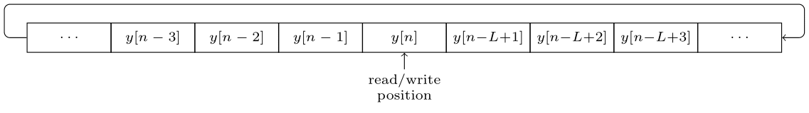

# Instrument Synthesis on STM32F4 Microcontroller

Instrument synthesis on STM32 microcontroller. A USB-MIDI host driver is included in order to allow a digital piano to control which note is played. Only the [Karplus-Strong algorithm](https://en.wikipedia.org/wiki/Karplus–Strong_string_synthesis) is implemented at the moment.

<!--- *************************************************************************************************** --->
## How it works
The audio data is stored in a ping-pong buffer so that one half of the buffer can be processed by the CPU while the DMA controller transfers data from the other half to the audio codec. The CPU calculates the audio data using the instrument model, then processes the USB-MIDI messages to see if a new note should be played. Once the CPU and the DMA controller complete their tasks, they switch buffer sections.

The number of individual audio samples in the buffer, `AUDIO_BUFFER_SIZE`, should be the smallest power of 2 >= twice the largest delay for the instrument model. To play the lowest note on a MIDI keyboard, the longest delay needed (with the Karplus-Strong model) is 1603, therefore `AUDIO_BUFFER_SIZE` should be `4096`. For stereo audio, `AUDIO_CHANNELS` is set to `2` so that each audio sample can be repeated.

```c
static int16_t audio_buffer[AUDIO_CHANNELS * AUDIO_BUFFER_SIZE];
```


### Karplus-Strong Algorithm
One of my goals for this project is to easily simulate a musical instrument on an embedded system with the aid of a mathematical model. As a prerequisite for this, I decided to start with a simple model and go from there (possibly until I reach the limit on what the hardware is capable of). Consequently, the code in its current state is somewhat coupled to the [Karplus-Strong algorithm](https://en.wikipedia.org/wiki/Karplus%E2%80%93Strong_string_synthesis) (shown below), so implementing another model is not straightforward.

<br/>
<p align="center">

</p>
<p align="center">
<em align="center">Source: <a href="https://ccrma.stanford.edu/~jos/pasp/Karplus_Strong_Algorithm.html">https://ccrma.stanford.edu/~jos/pasp/Karplus_Strong_Algorithm.html</a></em>
</p>


### Storing past values
The past values for the model are stored in a separate array from the audio data. This array is utilized in a similar way to a circular buffer, except that the read and write positions are the same. Everytime a new `y[n]` is calculated, the read/write position is incremented and the oldest value is overwritten by the newest value.

```c
static int16_t mem_buffer[AUDIO_BUFER_SIZE / 2];
```

<p align="center"></p>
<!--- *************************************************************************************************** --->

## Building
This has only been tested on a STM32F411E Discovery board.

Clone the repository and change working directory:
```bash
git clone https://github.com/rsantana0/stm32-instrument-synthesis.git
cd stm32-instrument-synthesis
```

Build the binary using the Makefile:
```bash
make
```

<!--- [ST-LINK](https://github.com/texane/stlink) --->