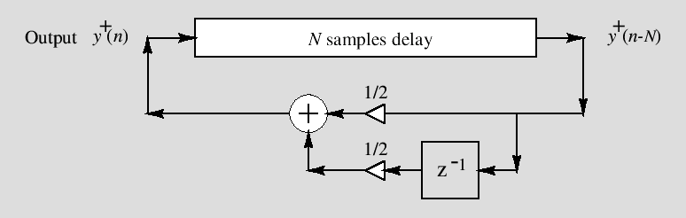
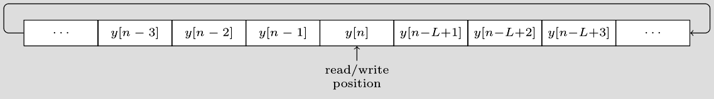

# Instrument Synthesis on STM32F4 Microcontroller

Instrument synthesis on STM32 microcontroller. A USB-MIDI host driver is included in order to allow a digital piano to control which note is played. Only the [Karplus-Strong algorithm](https://en.wikipedia.org/wiki/Karplus–Strong_string_synthesis) is implemented at the moment.

<!--- *************************************************************************************************** --->

## How it works
The audio data is stored in a ping-pong buffer so that one half of the buffer can be processed by the CPU while the DMA controller transfers data from the other half to the audio codec. The CPU calculates the audio data using the instrument model and then processes the USB-MIDI messages to see if a new note should be played. Once the CPU and the DMA controller complete their tasks, they switch buffer sections.

To simplify some calculations, `AUDIO_BUFFER_SIZE` should be the smallest power of 2 that is greater than or equal to twice the largest delay for the instrument model. The Karplus-Strong model would need, at most, a delay of 1603 for the lowest playable note on any MIDI keyboard. For this demo, `AUDIO_BUFFER_SIZE` is set to `4096` and `AUDIO_CHANNELS` is set to `2` to indicate that each sample should be repeated to produce stereo audio.

```c
static int16_t audio_buffer[AUDIO_CHANNELS * AUDIO_BUFFER_SIZE];
```


### Karplus-Strong algorithm
This goal for this project is to make it easier to experiment with instrument models using an already familiar musical interface like the MIDI keyboard. As a starting point and for demo purposes, I decided to use a simple model. Consequently, the code in its current state is somewhat coupled to the [Karplus-Strong algorithm](https://en.wikipedia.org/wiki/Karplus%E2%80%93Strong_string_synthesis) (shown below), so  implementing another model is not as straightforward as I would like.

<br/>
<p align="center">

</p>
<p align="center">
<em align="center">Source: <a href="https://ccrma.stanford.edu/~jos/pasp/Karplus_Strong_Algorithm.html">https://ccrma.stanford.edu/~jos/pasp/Karplus_Strong_Algorithm.html</a></em>
</p>


### The delay line

<p align="center"></p>

The `L` most recent audio samples are stored in a circular buffer that is separate from the audio buffer. Writing to this buffer results in the oldest sample being overwritten by the most recent sample, and reading from this buffer is non-destructive (i.e. the value being read is not discarded afterwards).

Just like the audio buffer, the size of this array is dependent on the largest delay needed. However, we do not require a ping-pong buffer or multiple audio channels for this array so we can just use `AUDIO_BUFFER_SIZE / 2`.

```c
static int16_t mem_buffer[AUDIO_BUFER_SIZE / 2];
```

<!--- *************************************************************************************************** --->

## Building and flashing
**Notice: This has only been tested on a STM32F411E Discovery board.**

Clone the repository and change the working directory:
```bash
git clone https://github.com/rsantana0/stm32-instrument-synthesis.git
cd stm32-instrument-synthesis
```

Build the binary using the Makefile (assuming you have the [GNU Arm Embedded toolchain](https://developer.arm.com/tools-and-software/open-source-software/developer-tools/gnu-toolchain/gnu-rm) installed):
```bash
make
```

Flash the binary to the microcontroller using [this ST-LINK tool](https://github.com/texane/stlink):
```bash
st-flash write build/instrument_synthesis.bin 0x8000000
```